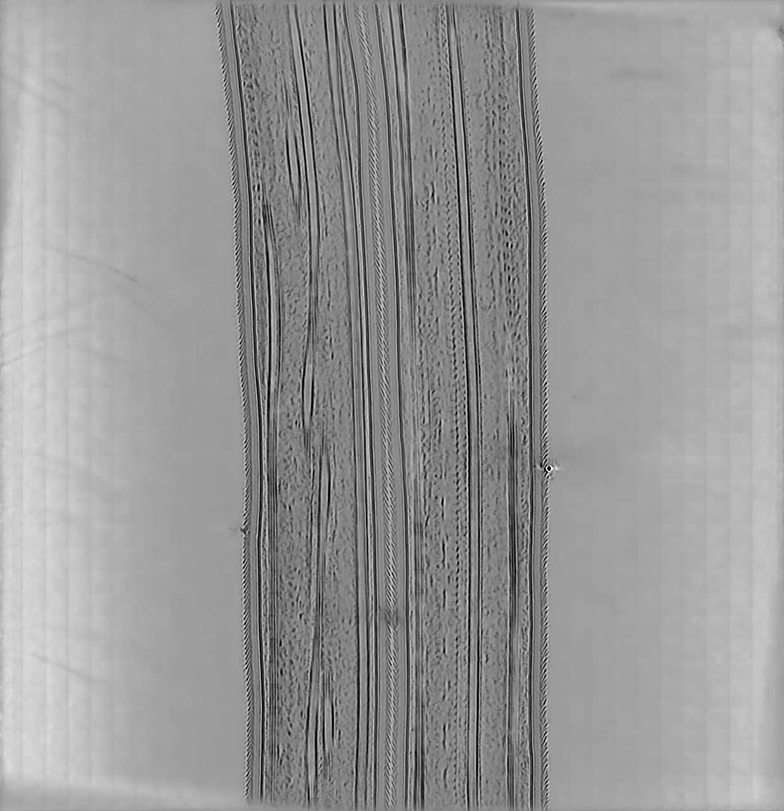
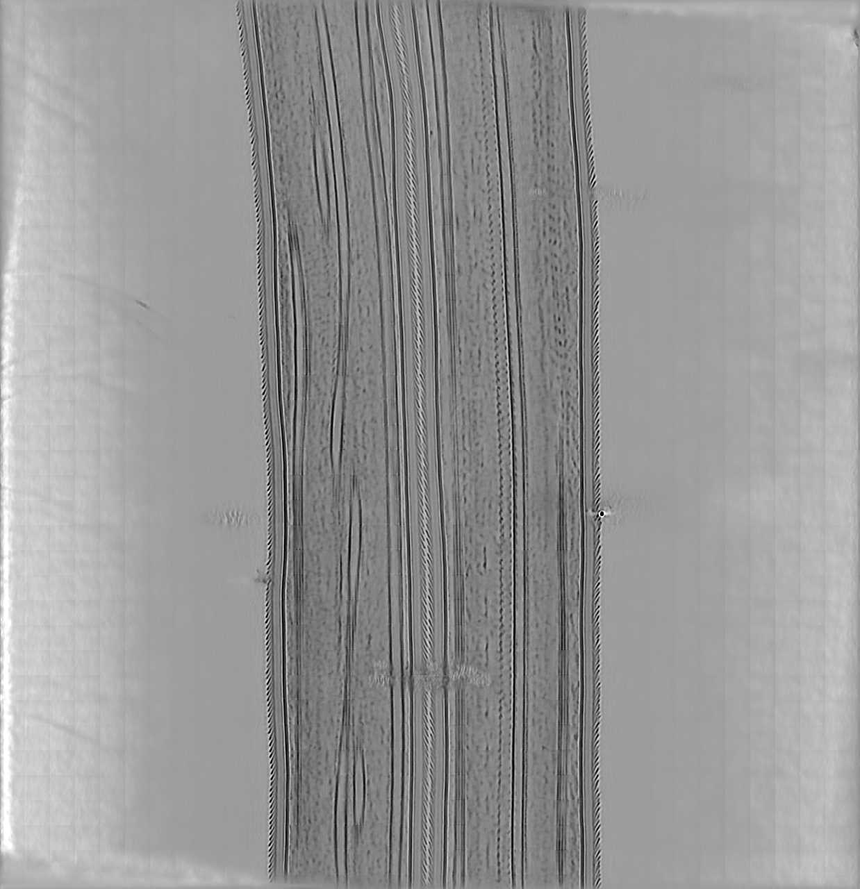

  <a href="./examples.html" class="btn">← Previous</a>
  <a href="../icecream.html" class="btn">Home</a>
  <a href="./reference.html" class="btn">Next →</a>

<h1 id="split">Influence of splitting strategy</h1>
Icecream requires two statistically independent tomograms. There are two choices for producing these volumes: either splitting the dose (requires recent cameras) or splitting the tilt angles (leaving less tilt to accurately reconstruct the volumes). In the following, we have quantitatively measured the difference between the two strategies. As already reported in the literature, we observed that splitting the dose produces slightly more denoised tomograms.

We use the dataset of flagella of C. reinhardtii, which is the tutorial dataset used in cryo-CARE and contains 10 raw frames per tilt. This flexibility allows us to compute 4 tomograms that are used by pairs to generate 2 independent results and then compute the FSC. The projections were collected at angles from −65° to +65° with 2° increments; pixel size is 2.36 Å. The tilt-series is further downsampled by a factor of 6, resulting in an effective pixel resolution of 14.16 Å.

* * * 
<h2 id="split-dose">Dose splitting</h2>

<!-- ====================== FIGURE 0 ====================== -->

  

  
 

  

    
  

  
🍦 ICECREAM

  

    
  

  
<!-- 

   

 -->

    <input type="range" id="sliceSlider0" min="0" max="52" step="1" value="26">
    Slice: 26
  

  

    <button id="zoomIn1">🔍 Zoom In</button>
    <button id="zoomOut1">➖ Zoom Out</button>
    <button id="resetZoom1">↩️ Reset</button>
  

  

* * * 
<h2 id="split-tilt">Tilt splitting</h2>
<!-- 

  

 -->

<!-- ====================== FIGURE 0 ====================== -->

  

  
 

  

    
  

  
🍦 ICECREAM

  

    
  

  

    <input type="range" id="sliceSlider00" min="0" max="52" step="1" value="26">
    Slice: 26
  

  

    <button id="zoomIn11">🔍 Zoom In</button>
    <button id="zoomOut11">➖ Zoom Out</button>
    <button id="resetZoom11">↩️ Reset</button>
  

  

* * * 
<h2 id="split-tilt">Tilt vs angle splitting</h2>
We display the FSC of Icecream depending on the splitting scheme, and we observe that the difference is only marginal in this example.

   

<!-- ====================== FIGURE 0 ====================== -->

  

  
 Dose splitting 

  

    
  

  
Angle splitting 

  

    
  

  

    <input type="range" id="sliceSlider000" min="0" max="52" step="1" value="26">
    Slice: 26
  

  

    <button id="zoomIn111">🔍 Zoom In</button>
    <button id="zoomOut111">➖ Zoom Out</button>
    <button id="resetZoom111">↩️ Reset</button>
  

  

  <a href="./examples.html" class="btn">← Previous</a>
  <a href="../icecream.html" class="btn">Home</a>
  <a href="./reference.html" class="btn">Next →</a>

<!-- [Projects home](./index.html) -->